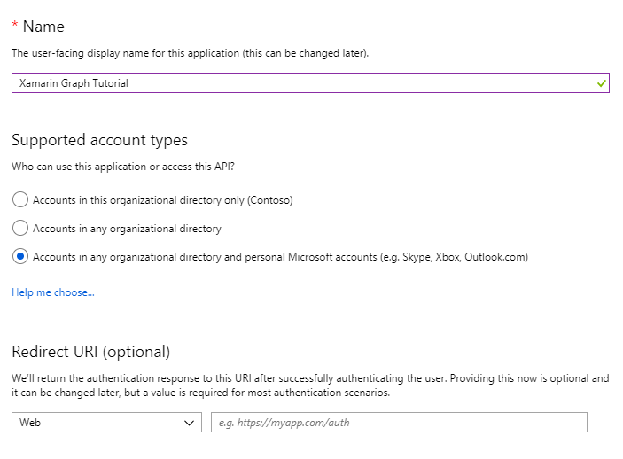
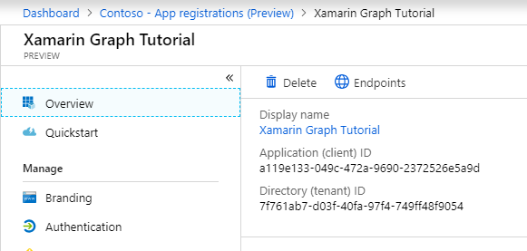

# How to run the completed project

## Prerequisites

To run the completed project in this folder, you need the following:

- [Visual Studio](https://visualstudio.microsoft.com/vs/) installed on your development machine. (**Note:** This tutorial was written with Visual Studio 2017 version 15.9.6 and Visual Studio for Mac version 7.7.4. The steps in this guide may work with other versions, but that has not been tested.)
- Xamarin installed as part of your Visual Studio installation. See [Installing Xamarin](https://docs.microsoft.com/xamarin/cross-platform/get-started/installation) for instructions on installing and configuring Xamarin.
- Either a personal Microsoft account with a mailbox on Outlook.com, or a Microsoft work or school account.

If you don't have a Microsoft account, there are a couple of options to get a free account:

- You can [sign up for a new personal Microsoft account](https://signup.live.com/signup?wa=wsignin1.0&rpsnv=12&ct=1454618383&rver=6.4.6456.0&wp=MBI_SSL_SHARED&wreply=https://mail.live.com/default.aspx&id=64855&cbcxt=mai&bk=1454618383&uiflavor=web&uaid=b213a65b4fdc484382b6622b3ecaa547&mkt=E-US&lc=1033&lic=1).
- You can [sign up for the Office 365 Developer Program](https://developer.microsoft.com/office/dev-program) to get a free Office 365 subscription.

## Register an application with the Azure Portal

1. Open a browser and navigate to the [Azure Active Directory admin center](https://aad.portal.azure.com). Login using a **personal account** (aka: Microsoft Account) or **Work or School Account**.

1. Select **New registration**. On the **Register an application** page, set the values as follows.

    - Set **Name** to `Xamarin Graph Tutorial`.
    - Set **Supported account types** to **Accounts in any organizational directory and personal Microsoft accounts**.
    - Leave **Redirect URI** empty.

    

1. Choose **Register**. On the **Xamarin Graph Tutorial** page, copy the value of the **Application (client) ID** and save it, you will need it in the next step.

    

1. Select the **Add a Redirect URI** link. On the **Redirect URIs** page, locate the **Suggested Redirect URIs for public clients (mobile, desktop)** section. Select the URI that begins with `msal` **and** the **urn:ietf:wg:oauth:2.0:oob** URI. Copy the value that begins with `msal`, then choose **Save**. Save the copied redirect URI, you will need it in the next step.

    

## Configure the sample

1. Rename the `./GraphTutorial/GraphTutorial/Models/OAuthSettings.cs.example` file to `OAuthSettings.cs`.
1. Edit the `OAuthSettings.cs` file and make the following changes.
    1. Replace `YOUR_APP_ID_HERE` with the **Application Id** you got from the Azure portal.
    1. Replace `YOUR_REDIRECT_URI_HERE` with the redirect URI that begins with `msal` you got from the Azure portal.
1. In the **GraphTutorial.iOS** project, open the `Info.plist` file.
    1. On the **Advanced** tab, locate the **URL Types** section. Change the **URL Schemes** entry from `YOUR_REDIRECT_URI_HERE` to the redirect URI from your app registration that begins with `msal`.
1. In the **GraphTutorial.Android** project, expand the **Properties** folder. Right-click the **AndroidManifest.xml** file and select **Open With**, then **Source Code Editor**.
    1. Replace `YOUR_APP_ID_HERE` with the **Application Id** you got from the Azure portal.

## Run the sample

In Visual Studio, press **F5** or choose **Debug > Start Debugging**.
