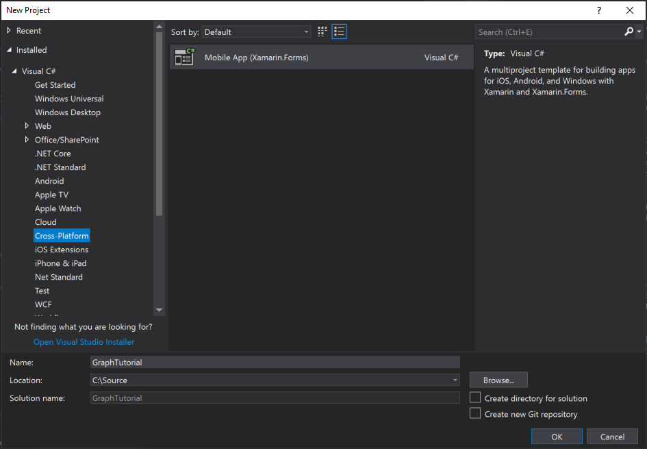
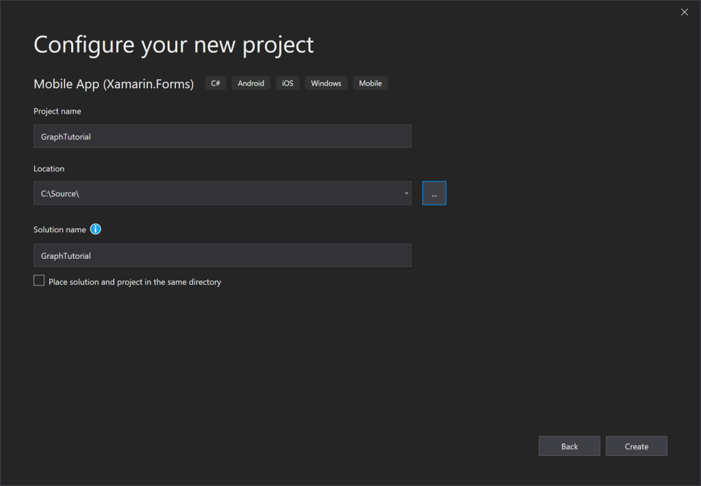
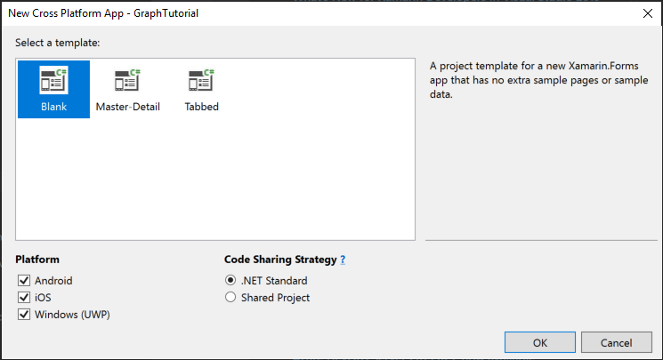
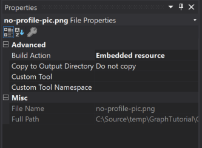
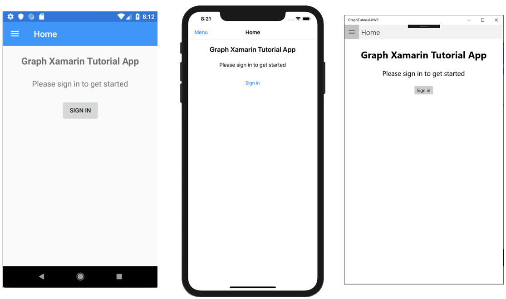

<!-- markdownlint-disable MD002 MD041 -->

1. Open Visual Studio, and select **Create a new project**.

1. In the **Create a new project** dialog, choose **Mobile App (Xamarin.Forms)**, then select **Next**.

    

1. In the **Configure a new project** dialog, enter `GraphTutorial` for the **Project name** and **Solution name**, then select **Create**.

    > [!IMPORTANT]
    > Ensure that you enter the exact same name for the Visual Studio Project that is specified in these lab instructions. The Visual Studio Project name becomes part of the namespace in the code. The code inside these instructions depends on the namespace matching the Visual Studio Project name specified in these instructions. If you use a different project name the code will not compile unless you adjust all the namespaces to match the Visual Studio Project name you enter when you create the project.

    

1. In the **New Cross Platform App** dialog, select the **Blank** template, and select the platforms you want to build under **Platforms**. Select **OK** to create the solution.

    

## Install packages

Before moving on, install some additional NuGet packages that you will use later.

- [Microsoft.Identity.Client](https://www.nuget.org/packages/Microsoft.Identity.Client/) to handle Azure AD authentication and token management.
- [Microsoft.Graph](https://www.nuget.org/packages/Microsoft.Graph/) for making calls to the Microsoft Graph.

1. Select **Tools > NuGet Package Manager > Package Manager Console**.

1. In the Package Manager Console, enter the following commands.

    ```Powershell
    Install-Package Microsoft.Identity.Client -Version 4.24.0 -Project GraphTutorial
    Install-Package Microsoft.Identity.Client -Version 4.24.0 -Project GraphTutorial.Android
    Install-Package Microsoft.Identity.Client -Version 4.24.0 -Project GraphTutorial.iOS
    Install-Package Microsoft.Graph -Version 3.21.0 -Project GraphTutorial
    ```

## Design the app

Start by updating the `App` class to add variables to track the authentication state and the signed-in user.

1. In **Solution Explorer**, expand the **GraphTutorial** project, then expand the **App.xaml** file. Open the **App.xaml.cs** file and add the following `using` statements to the top of the file.

    ```csharp
    using System.ComponentModel;
    using System.IO;
    using System.Reflection;
    using System.Threading.Tasks;
    ```

1. Add the `INotifyPropertyChanged` interface to the class declaration.

    ```csharp
    public partial class App : Application, INotifyPropertyChanged
    ```

1. Add the following properties to the `App` class.

    :::code language="csharp" source="../demo/GraphTutorial/GraphTutorial/App.xaml.cs" id="GlobalPropertiesSnippet":::

1. Add the following functions to the `App` class. The `SignIn`, `SignOut`, and `GetUserInfo` functions are just placeholders for now.

    ```csharp
    public async Task SignIn()
    {
        await GetUserInfo();

        IsSignedIn = true;
    }

    public async Task SignOut()
    {
        UserPhoto = null;
        UserName = string.Empty;
        UserEmail = string.Empty;
        IsSignedIn = false;
    }

    private async Task GetUserInfo()
    {
        UserPhoto = ImageSource.FromStream(() => GetUserPhoto());
        UserName = "Adele Vance";
        UserEmail = "adelev@contoso.com";
    }

    private Stream GetUserPhoto()
    {
        // Return the default photo
        return Assembly.GetExecutingAssembly().GetManifestResourceStream("GraphTutorial.no-profile-pic.png");
    }
    ```

1. The `GetUserPhoto` function returns a default photo for now. You can either supply your own file, or you can download the one used in the sample from [GitHub](https://github.com/microsoftgraph/msgraph-training-xamarin/blob/master/tutorial/images/no-profile-pic.png). If you use your own file, rename it to **no-profile-pic.png**.

1. Copy the file to the **./GraphTutorial/GraphTutorial** directory.

1. Right-click the file in **Solution Explorer** and select **Properties**. In the **Properties** window, change the value of **Build Action** to **Embedded resource**.

    

### App navigation

In this section, you'll change the application's main page to a [Master-Detail page](/xamarin/xamarin-forms/app-fundamentals/navigation/master-detail-page). This will provide a navigation menu to switch between view in the app.

1. Open the **MainPage.xaml** file in the **GraphTutorial** project and replace its contents with the following.

    :::code language="xaml" source="../demo/GraphTutorial/GraphTutorial/MainPage.xaml":::

#### Implement the menu

1. Right-click the **GraphTutorial** project and select **Add**, then **New Folder**. Name the folder `Models`.

1. Right-click the **Models** folder and select **Add**, then **Class...**. Name the class `NavMenuItem` and select **Add**.

1. Open the **NavMenuItem.cs** file and replace its contents with the following.

    :::code language="csharp" source="../demo/GraphTutorial/GraphTutorial/Models/NavMenuItem.cs" id="NavMenuItemSnippet":::

1. Right-click the **GraphTutorial** project and select **Add**, then **New Item...**. Choose **Content Page** and name the page `MenuPage`. Select **Add**.

1. Open the **MenuPage.xaml** file and replace its contents with the following.

    :::code language="xaml" source="../demo/GraphTutorial/GraphTutorial/MenuPage.xaml":::

1. Expand **MenuPage.xaml** in **Solution Explorer** and open the **MenuPage.xaml.cs** file. Replace its contents with the following.

    :::code language="csharp" source="../demo/GraphTutorial/GraphTutorial/MenuPage.xaml.cs" id="MenuPageSnippet":::

    > [!NOTE]
    > Visual Studio will report errors in **MenuPage.xaml.cs**. These errors will be resolved in a later step.

#### Implement the welcome page

1. Right-click the **GraphTutorial** project and select **Add**, then **New Item...**. Choose **Content Page** and name the page `WelcomePage`. Select **Add**. Open the **WelcomePage.xaml** file and replace its contents with the following.

    :::code language="xaml" source="../demo/GraphTutorial/GraphTutorial/WelcomePage.xaml":::

1. Expand **WelcomePage.xaml** in **Solution Explorer** and open the **WelcomePage.xaml.cs** file. Add the following function to the `WelcomePage` class.

    :::code language="csharp" source="../demo/GraphTutorial/GraphTutorial/WelcomePage.xaml.cs" id="OnSignInSnippet":::

#### Add calendar and new event pages

Now add a calendar page and a new event page. These will just be placeholders for now.

1. Right-click the **GraphTutorial** project and select **Add**, then **New Item...**. Choose **Content Page** and name the page `CalendarPage`. Select **Add**.

1. Right-click the **GraphTutorial** project and select **Add**, then **New Item...**. Choose **Content Page** and name the page `NewEventPage`. Select **Add**.

#### Update MainPage code-behind

Now that all of the pages are in place, update the code-behind for **MainPage.xaml**.

1. Expand **MainPage.xaml** in **Solution Explorer** and open the **MainPage.xaml.cs** file and replace its entire contents with the following.

    :::code language="csharp" source="../demo/GraphTutorial/GraphTutorial/MainPage.xaml.cs" id="MainPageSnippet":::

1. Save all of your changes. Right-click the project that you want to run (Android, iOS, or UWP) and select **Set as StartUp Project**. Press **F5** or select **Debug > Start Debugging** in Visual Studio.

    
