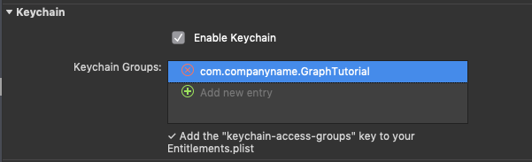
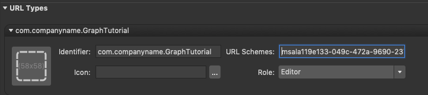
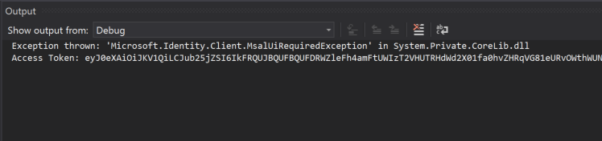

<!-- markdownlint-disable MD002 MD041 -->

In this exercise you will extend the application from the previous exercise to support authentication with Azure AD. This is required to obtain the necessary OAuth access token to call the Microsoft Graph. In this step you will integrate the [Microsoft Authentication Library for .NET (MSAL)](https://github.com/AzureAD/microsoft-authentication-library-for-dotnet) into the application.

1. In **Solution Explorer**, expand the **GraphTutorial** project and right-click the **Models** folder. Select **Add > Class...**. Name the class `OAuthSettings` and select **Add**.

1. Open the **OAuthSettings.cs** file and replace its contents with the following.

    :::code language="csharp" source="../demo/GraphTutorial/GraphTutorial/Models/OAuthSettings.cs.example":::

1. Replace `YOUR_APP_ID_HERE` with the application ID from your app registration.

    > [!IMPORTANT]
    > If you're using source control such as git, now would be a good time to exclude the `OAuthSettings.cs` file from source control to avoid inadvertently leaking your app ID.

## Implement sign-in

1. Open the **App.xaml.cs** file in the **GraphTutorial** project, and add the following `using` statements to the top of the file.

    ```csharp
    using GraphTutorial.Models;
    using Microsoft.Identity.Client;
    using Microsoft.Graph;
    using System.Diagnostics;
    using System.Linq;
    using System.Net.Http.Headers;
    ```

1. Change the **App** class declaration line to resolve the name conflict for **Application**.

    ```csharp
    public partial class App : Xamarin.Forms.Application, INotifyPropertyChanged
    ```

1. Add the following properties to the `App` class.

    :::code language="csharp" source="../demo/GraphTutorial/GraphTutorial/App.xaml.cs" id="AuthPropertiesSnippet":::z

1. Next, create a new `PublicClientApplication` in the constructor of the `App` class.

    :::code language="csharp" source="../demo/GraphTutorial/GraphTutorial/App.xaml.cs" id="AppConstructorSnippet" highlight="5-13":::

1. Update the `SignIn` function to use the `PublicClientApplication` to get an access token. Add the following code above the `await GetUserInfo();` line.

    :::code language="csharp" source="../demo/GraphTutorial/GraphTutorial/App.xaml.cs" id="GetTokenSnippet":::

    This code first attempts to get an access token silently. If a user's information is already in the app's cache (for example, if the user closed the app previously without signing out), this will succeed, and there's no reason to prompt the user. If there is not a user's information in the cache, the `AcquireTokenSilent().ExecuteAsync()` function throws an `MsalUiRequiredException`. In this case, the code calls the interactive function to get a token, `AcquireTokenInteractive`.

1. Update the `SignOut` function to remove the user's information from the cache. Add the following code to the beginning of the `SignOut` function.

    :::code language="csharp" source="../demo/GraphTutorial/GraphTutorial/App.xaml.cs" id="RemoveAccountSnippet":::

### Update Android project to enable sign-in

When used in a Xamarin Android project, the Microsoft Authentication Library has a few [requirements specific to Android](https://github.com/AzureAD/microsoft-authentication-library-for-dotnet/wiki/Xamarin-Android-specifics).

First, you need to update the Android manifest to register the redirect URI. In **GraphTutorial.Android** project, expand the **Properties** folder, then open **AndroidManifest.xml**. If you're using Visual Studio for Mac, switch to the **Source** view using the tabs at the bottom of the file. Replace the entire contents with the following.

```xml
<?xml version="1.0" encoding="utf-8"?>
<manifest xmlns:android="http://schemas.android.com/apk/res/android" android:versionCode="1" android:versionName="1.0" package="com.companyname.GraphTutorial">
    <uses-sdk android:minSdkVersion="21" android:targetSdkVersion="28" />
    <application android:label="GraphTutorial.Android">
        <activity android:name="microsoft.identity.client.BrowserTabActivity">
            <intent-filter>
                <action android:name="android.intent.action.VIEW" />
                <category android:name="android.intent.category.DEFAULT" />
                <category android:name="android.intent.category.BROWSABLE" />
                <data android:scheme="msalYOUR_APP_ID_HERE" android:host="auth" />
            </intent-filter>
        </activity>
    </application>
    <uses-permission android:name="android.permission.ACCESS_NETWORK_STATE" />
    <uses-permission android:name="android.permission.INTERNET" />
</manifest>
```

Replace `YOUR_APP_ID_HERE` with your application ID from your app registration.

Next, open **MainActivity.cs** and add the following `using` statements to the top of the file.

```cs
using Microsoft.Identity.Client;
using Android.Content;
```

Then, override the `OnActivityResult` function to pass control to the MSAL library. Add the following to the `MainActivity` class.

```cs
protected override void OnActivityResult(int requestCode, Result resultCode, Intent data)
{
    base.OnActivityResult(requestCode, resultCode, data);
    AuthenticationContinuationHelper
        .SetAuthenticationContinuationEventArgs(requestCode, resultCode, data);
}
```

Finally, in the `OnCreate` function, add the following line after the `LoadApplication(new App());` line.

```cs
App.AuthUIParent = this;
```

### Update iOS project to enable sign-in

> [!IMPORTANT]
> Because MSAL requires use of an Entitlements.plist file, you must configure Visual Studio with your Apple developer account to enable provisioning. If you are running this tutorial in the iPhone simulator, you need to add **Entitlements.plist** in the **Custom Entitlements** field in **GraphTutorial.iOS** project's settings, **Build->iOS Bundle Signing**. For more information, see [Device provisioning for Xamarin.iOS](/xamarin/ios/get-started/installation/device-provisioning).

When used in a Xamarin iOS project, the Microsoft Authentication Library has a few [requirements specific to iOS](https://github.com/AzureAD/microsoft-authentication-library-for-dotnet/wiki/Xamarin-iOS-specifics).

First, you need to enable Keychain access. In Solution Explorer, expand the **GraphTutorial.iOS** project, then open the **Entitlements.plist** file. Locate the **Keychain** entitlement, and select **Enable KeyChain**. In **Keychain Groups**, add an entry with the format `com.YOUR_DOMAIN.GraphTutorial`.



Next, you need to register the default MSAL redirect URI as a URL type that your app handles. Open the **Info.plist** file and make the following changes.

- On the **Application** tab, check that the value of **Bundle identifier** matches the value you set for **Keychain Groups** in **Entitlements.plist**. If it doesn't, update it now.
- On the **Advanced** tab, locate the **URL Types** section. Add a URL type here with the following values:
  - **Identifier**: set to the value of your **Bundle identifier**
  - **URL Schemes**: set to `msal{YOUR-APP-ID}`. For example, if your app ID is `67ad5eba-0cfc-414d-8f9f-0a6d973a907c`, you would set this to `msal67ad5eba-0cfc-414d-8f9f-0a6d973a907c`.
  - **Role**: `Editor`
  - **Icon**: Leave empty



Finally, update the code in the **GraphTutorial.iOS** project to handle the redirect during authentication. Open the **AppDelegate.cs** file and add the following `using` statement at the top of the file.

```cs
using Microsoft.Identity.Client;
```

Add the following line to `FinishedLaunching` function just before the `LoadApplication(new App());` line.

```cs
// Specify the Keychain access group
App.iOSKeychainSecurityGroup = NSBundle.MainBundle.BundleIdentifier;
```

Finally, override the `OpenUrl` function to pass the URL to the MSAL library. Add the following to the `AppDelegate` class.

```cs
// Handling redirect URL
// See: https://github.com/azuread/microsoft-authentication-library-for-dotnet/wiki/Xamarin-iOS-specifics
public override bool OpenUrl(UIApplication app, NSUrl url, NSDictionary options)
{
    AuthenticationContinuationHelper.SetAuthenticationContinuationEventArgs(url);
    return true;
}
```

## Storing the tokens

When the Microsoft Authentication Library is used in a Xamarin project, it takes advantage of the native secure storage to cache tokens by default. See [Token cache serialization](https://github.com/AzureAD/microsoft-authentication-library-for-dotnet/wiki/token-cache-serialization) for more information.

## Test sign-in

At this point if you run the application and tap the **Sign in** button, you are prompted to sign in. On successful sign in, you should see the access token printed into the debugger's output.



## Get user details

Add a new function to the **App** class to initialize the `GraphServiceClient`.

```cs
private async Task InitializeGraphClientAsync()
{
    var currentAccounts = await PCA.GetAccountsAsync();
    try
    {
        if (currentAccounts.Count() > 0)
        {
            // Initialize Graph client
            GraphClient = new GraphServiceClient(new DelegateAuthenticationProvider(
                async (requestMessage) =>
                {
                    var result = await PCA.AcquireTokenSilent(Scopes, currentAccounts.FirstOrDefault())
                        .ExecuteAsync();

                    requestMessage.Headers.Authorization =
                        new AuthenticationHeaderValue("Bearer", result.AccessToken);
                }));

            await GetUserInfo();

            IsSignedIn = true;
        }
        else
        {
            IsSignedIn = false;
        }
    }
    catch(Exception ex)
    {
        Debug.WriteLine(
            $"Failed to initialized graph client. Accounts in the msal cache: {currentAccounts.Count()}. See exception message for details: {ex.Message}");
    }
}
```

Now update the `SignIn` function in **App.xaml.cs** to call this function instead of `GetUserInfo`. Remove the following from the `SignIn` function.

```cs
await GetUserInfo();

IsSignedIn = true;
```

Add the following to the end of the `SignIn` function.

```cs
await InitializeGraphClientAsync();
```

Now update the `GetUserInfo` function to get the user's details from the Microsoft Graph. Replace the existing `GetUserInfo` function with the following.

```cs
private async Task GetUserInfo()
{
    // Get the logged on user's profile (/me)
    var user = await GraphClient.Me.Request().GetAsync();

    UserPhoto = ImageSource.FromStream(() => GetUserPhoto());
    UserName = user.DisplayName;
    UserEmail = string.IsNullOrEmpty(user.Mail) ? user.UserPrincipalName : user.Mail;
}
```

If you save your changes and run the app now, after sign-in the UI is updated with the user's display name and email address.
