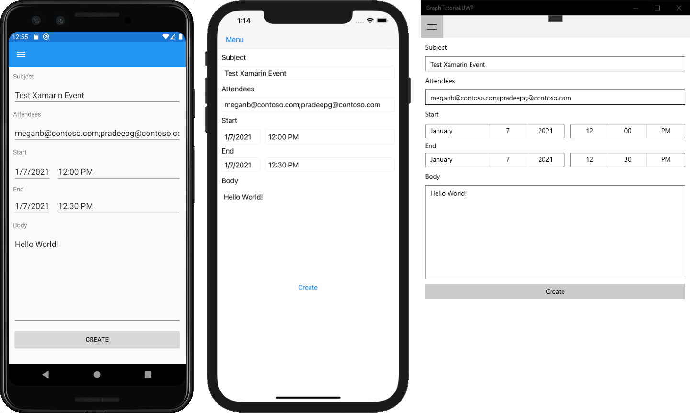

<!-- markdownlint-disable MD002 MD041 -->

In this section you will add the ability to create events on the user's calendar.

1. Open **NewEventPage.xaml** and replace its contents with the following.

    :::code language="xaml" source="../demo/GraphTutorial/GraphTutorial/NewEventPage.xaml":::

1. Open **NewEventPage.xaml.cs** and add the following `using` statements to the top of the file.

    ```csharp
    using System.ComponentModel;
    using Microsoft.Graph;
    ```

1. Add the **INotifyPropertyChange** interface to the **NewEventPage** class. Replace the existing class declaration with the following.

    ```csharp
    [XamlCompilation(XamlCompilationOptions.Compile)]
    public partial class NewEventPage : ContentPage, INotifyPropertyChanged
    {
        public NewEventPage()
        {
            InitializeComponent();
            BindingContext = this;
        }
    }
    ```

1. Add the following properties to the **NewEventPage** class.

    :::code language="csharp" source="../demo/GraphTutorial/GraphTutorial/NewEventPage.xaml.cs" id="PropertiesSnippet":::

1. Add the following code to create the event.

    :::code language="csharp" source="../demo/GraphTutorial/GraphTutorial/NewEventPage.xaml.cs" id="CreateEventSnippet":::

1. Save your changes and run the app. Sign in, select the **New event** menu item, fill in the form, and select **Create** to add an event to the user's calendar.

    
