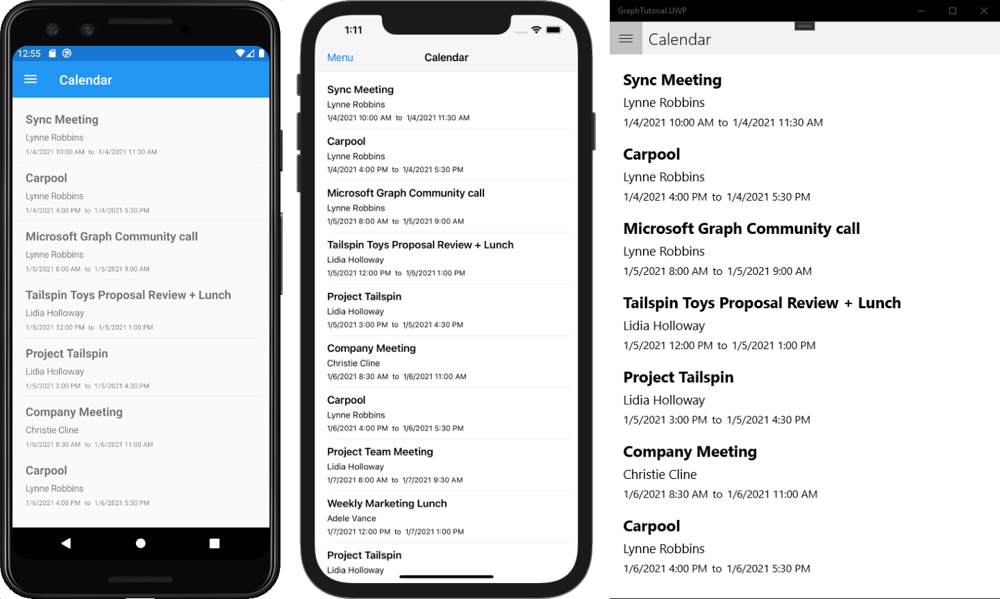

<!-- markdownlint-disable MD002 MD041 -->

In this exercise you will incorporate the Microsoft Graph into the application. For this application, you will use the [Microsoft Graph Client Library for .NET](https://github.com/microsoftgraph/msgraph-sdk-dotnet) to make calls to Microsoft Graph.

## Get calendar events from Outlook

Start by updating the **CalendarPage.xaml** file in the **GraphTutorial** project. Open the file and replace its contents with the following.

```xml
<?xml version="1.0" encoding="utf-8" ?>
<ContentPage xmlns="http://xamarin.com/schemas/2014/forms"
             xmlns:x="http://schemas.microsoft.com/winfx/2009/xaml"
             Title="Calendar"
             x:Class="GraphTutorial.CalendarPage">
    <ContentPage.Content>
        <StackLayout>
            <Editor x:Name="JSONResponse"
                    IsSpellCheckEnabled="False"
                    HorizontalOptions="FillAndExpand"
                    VerticalOptions="FillAndExpand"/>
        </StackLayout>
    </ContentPage.Content>
</ContentPage>
```

Open `CalendarPage.xaml.cs` and add the following `using` statements at the top of the file.

```cs
using Newtonsoft.Json;
using Microsoft.Graph;
using System.ComponentModel;
using System.Collections.ObjectModel;
```

Then add the following code to get the user's events and display the JSON response.

```cs
protected override async void OnAppearing()
{
    base.OnAppearing();

    // Get the events
    var events = await App.GraphClient.Me.Events.Request()
        .Select("subject,organizer,start,end")
        .OrderBy("createdDateTime DESC")
        .GetAsync();

    // Temporary
    JSONResponse.Text = JsonConvert.SerializeObject(events.CurrentPage, Formatting.Indented);
}
```

Consider what the code in `OnAppearing` is doing.

- The URL that will be called is `/v1.0/me/events`.
- The `Select` function limits the fields returned for each events to just those the view will actually use.
- The `OrderBy` function sorts the results by the date and time they were created, with the most recent item being first.

You can now run the app, sign in, and click the **Calendar** navigation item in the menu. You should see a JSON dump of the events on the user's calendar.

## Display the results

Now you can replace the JSON dump with something to display the results in a user-friendly manner. Start by creating a [binding value converter](/xamarin/xamarin-forms/xaml/xaml-basics/data-binding-basics#binding-value-converters) to convert the [dateTimeTimeZone](/graph/api/resources/datetimetimezone?view=graph-rest-1.0) values returned by Microsoft Graph into the date and time formats the user expects. Right-click the **Models** folder in the **GraphTutorial** project and choose **New**, then **Class...**. Name the class `GraphDateTimeTimeZoneConverter` and choose **Add**. Replace the entire contents of the file with the following.

```cs
using Microsoft.Graph;
using System;
using System.Globalization;
using Xamarin.Forms;

namespace GraphTutorial.Models
{
    class GraphDateTimeTimeZoneConverter : IValueConverter
    {
        public object Convert(object value, Type targetType, object parameter, CultureInfo culture)
        {
            if (value is DateTimeTimeZone date)
            {
                // Resolve the time zone
                var timezone = TimeZoneInfo.FindSystemTimeZoneById(date.TimeZone);
                // Parse method assumes local time, which may not be the case
                var parsedDateAsLocal = DateTimeOffset.Parse(date.DateTime);
                // Determine the offset from UTC time for the specific date
                // Making this call adjusts for DST as appropriate
                var tzOffset = timezone.GetUtcOffset(parsedDateAsLocal.DateTime);
                // Create a new DateTimeOffset with the specific offset from UTC
                var correctedDate = new DateTimeOffset(parsedDateAsLocal.DateTime, tzOffset);
                // Return the local date time string
                return $"{correctedDate.LocalDateTime.ToShortDateString()} {correctedDate.LocalDateTime.ToShortTimeString()}";
            }

            return string.Empty;
        }

        public object ConvertBack(object value, Type targetType, object parameter, CultureInfo culture)
        {
            throw new NotImplementedException();
        }
    }
}
```

Next, replace the entire contents of `CalendarPage.xaml` with the following.

```xml
<?xml version="1.0" encoding="utf-8" ?>
<ContentPage xmlns="http://xamarin.com/schemas/2014/forms"
             xmlns:x="http://schemas.microsoft.com/winfx/2009/xaml"
             xmlns:local="clr-namespace:GraphTutorial.Models"
             Title="Calendar"
             x:Class="GraphTutorial.CalendarPage">
    <ContentPage.Resources>
        <local:GraphDateTimeTimeZoneConverter x:Key="DateConverter" />
    </ContentPage.Resources>
    <ContentPage.Content>
        <StackLayout>
            <ListView x:Name="CalendarList"
                      VerticalOptions="StartAndExpand"
                      Margin="10,10,10,10">
                <ListView.ItemTemplate>
                    <DataTemplate>
                        <ViewCell>
                            <StackLayout Margin="10,10,10,10">
                                <Label Text="{Binding Path=Subject}"
                                       FontAttributes="Bold"
                                       FontSize="Medium" />
                                <Label Text="{Binding Path=Organizer.EmailAddress.Name}"
                                       FontSize="Small" />
                                <StackLayout Orientation="Horizontal">
                                    <Label Text="{Binding Path=Start, Converter={StaticResource DateConverter}}"
                                       FontSize="Micro" />
                                    <Label Text="to"
                                           FontSize="Micro" />
                                    <Label Text="{Binding Path=End, Converter={StaticResource DateConverter}}"
                                       FontSize="Micro" />
                                </StackLayout>
                            </StackLayout>
                        </ViewCell>
                    </DataTemplate>
                </ListView.ItemTemplate>
            </ListView>
        </StackLayout>
    </ContentPage.Content>
</ContentPage>
```

This replaces the `Editor` with a `ListView`. The `DataTemplate` used to render each item uses the `GraphDateTimeTimeZoneConverter` to convert the `Start` and `End` properties of the event to a string. Now open `CalendarPage.xaml.cs` and remove the following lines from the `OnAppearing` function.

```cs
// Temporary
JSONResponse.Text = JsonConvert.SerializeObject(events.CurrentPage, Formatting.Indented);
```

In their place, add the following code.

```cs
// Add the events to the list view
CalendarList.ItemsSource = events.CurrentPage.ToList();
```

Run the app, sign in, and click the **Calendar** navigation item. You should see the list of events with the **Start** and **End** values formatted.


